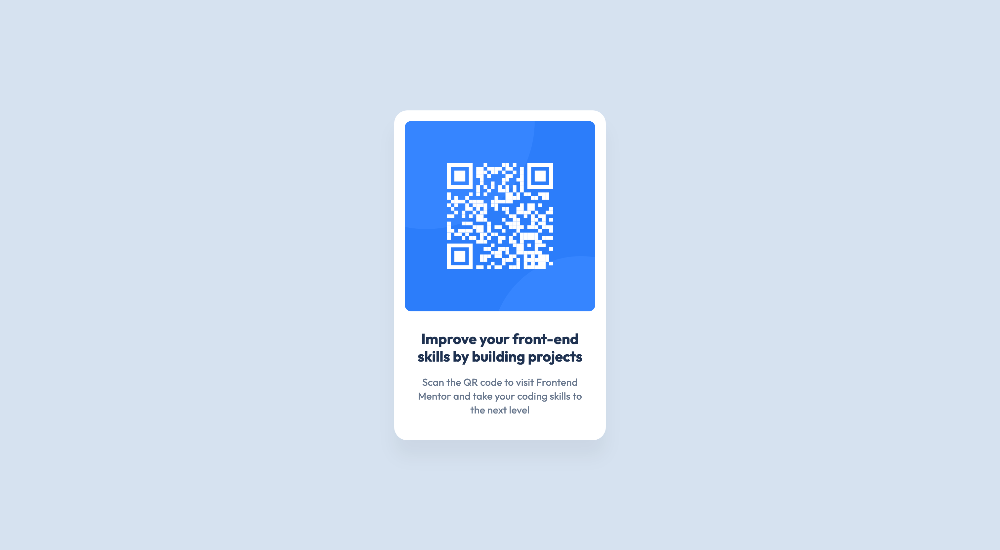

# Frontend Mentor - QR code component solution

This is a solution to the [QR code component challenge on Frontend Mentor](https://www.frontendmentor.io/challenges/qr-code-component-iux_sIO_H).

## Table of contents

- [Overview](#overview)
  - [Screenshot](#screenshot)
  - [Links](#links)
- [My process](#my-process)
  - [Built with](#built-with)
  - [What I learned](#what-i-learned)
  - [Continued development](#continued-development)
- [Author](#author)

## Overview

### Screenshot

A simple QR component.

### Links

- Solution URL: [Solution](https://github.com/ccorley23/FEM-QR-Challenge.git)
- Live Site URL: [Solution](https://ccorley23.github.io/FEM-QR-Challenge/)

## My process

To build this QR component, I started by writing all of the HTML for the content that needed to be displayed on the webpage. This included any images, titles, paragraphs, and any containers that I would need for the placement of the QR component card.

Before jumping to the CSS, I analyzed the figma design and took notes of the size of the elements, as well as any box-shadows, padding, margins, and text size.

After making notes of these details, I started writing the CSS for QR component to style it according to the figma design with all of the exact font-sizes, box-shadow properties, and overall sizing.

### Built with

- Semantic HTML5 markup
- CSS custom properties
- Flexbox
- Desktop-first workflow

### What I learned

One of the biggest things I learned was how to take a design from an application (in this case Figma) and implement it with the correct text/font specifications, padding, etc.

### Continued development

In the future, when I start creating more complicated websites, I would like to focus more on accessibility. I would also like to improve on my HTML. I want to write clean HTML code that does not have any "useless" tags that could be removed.

As the challenges I work on get harder, I would also like to work on making the elements on my website responsive.

## Author

- Developer - [Cristina Corley](https://github.com/ccorley23)
- Frontend Mentor - [@ccorley23](https://www.frontendmentor.io/profile/ccorley23)
- Github - [@ccorley](https://github.com/ccorley23)
